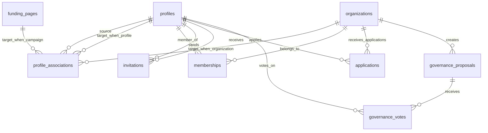

# 🎯 Association System: Masterpiece Architecture Design

## Executive Summary

This document outlines the architectural design for a **groundbreaking association system** that will transform OrangeCat from individual profiles to a fully interconnected social platform. This is not just another feature - it's a **new paradigm for Bitcoin-native social connections**.

## 🏗️ Systems Design Philosophy

### Core Principles
1. **Zero Breaking Changes**: Existing functionality continues to work flawlessly
2. **Progressive Enhancement**: Each component adds value without requiring others
3. **Event-Sourced Architecture**: Every relationship change is tracked and auditable
4. **Bitcoin-Native Design**: All relationships can involve Bitcoin transactions/rewards
5. **Real-Time Synchronization**: Changes propagate instantly across the platform
6. **Masterful Abstraction**: Complex relationships made simple for users

### Inspirational Vision
- **LinkedIn for Bitcoin**: Professional networking with direct value transfer
- **GitHub for Fundraising**: Collaboration with transparent contribution tracking  
- **Discord for DAOs**: Community building with built-in governance
- **Wikipedia for Crowdfunding**: Democratic curation of worthy causes

## 🗄️ Database Architecture: Tesla-Grade Foundation

### Entity-Relationship Model



### Core Tables Design

#### 1. `profile_associations` - The Heart of Connections
```sql
CREATE TABLE profile_associations (
  -- Identity & Relationships
  id UUID PRIMARY KEY DEFAULT gen_random_uuid(),
  source_profile_id UUID NOT NULL REFERENCES profiles(id) ON DELETE CASCADE,
  target_entity_id UUID NOT NULL,
  target_entity_type entity_type_enum NOT NULL,
  
  -- Relationship Semantics
  relationship_type relationship_type_enum NOT NULL,
  role VARCHAR(100),
  status association_status_enum DEFAULT 'active',
  
  -- Bitcoin Integration
  bitcoin_reward_address VARCHAR(255), -- Reward address for this association
  reward_percentage DECIMAL(5,2) DEFAULT 0.00, -- % of donations to redirect
  
  -- Metadata & Permissions
  permissions JSONB DEFAULT '{}', -- Role-specific permissions
  metadata JSONB DEFAULT '{}', -- Flexible relationship data
  visibility visibility_enum DEFAULT 'public',
  
  -- Temporal Tracking
  starts_at TIMESTAMPTZ DEFAULT NOW(),
  ends_at TIMESTAMPTZ, -- For time-limited relationships
  created_at TIMESTAMPTZ DEFAULT NOW(),
  updated_at TIMESTAMPTZ DEFAULT NOW(),
  
  -- Event Sourcing
  version INTEGER DEFAULT 1,
  created_by UUID REFERENCES profiles(id),
  last_modified_by UUID REFERENCES profiles(id),
  
  -- Constraints & Indexes
  UNIQUE(source_profile_id, target_entity_id, relationship_type),
  CHECK (target_entity_id != source_profile_id), -- No self-associations
  CHECK (reward_percentage >= 0 AND reward_percentage <= 100)
);
```

#### 2. `organizations` - Collective Entities
```sql
CREATE TABLE organizations (
  -- Core Identity
  id UUID PRIMARY KEY DEFAULT gen_random_uuid(),
  profile_id UUID NOT NULL REFERENCES profiles(id) ON DELETE CASCADE,
  
  -- Organization Details
  name VARCHAR(255) NOT NULL,
  slug VARCHAR(100) UNIQUE NOT NULL,
  description TEXT,
  website_url VARCHAR(500),
  avatar_url VARCHAR(500),
  banner_url VARCHAR(500),
  
  -- Categorization
  type organization_type_enum NOT NULL,
  category VARCHAR(100),
  tags TEXT[] DEFAULT '{}',
  
  -- Governance & Operations
  governance_model governance_model_enum DEFAULT 'hierarchical',
  treasury_address VARCHAR(255), -- Multi-sig Bitcoin address
  is_public BOOLEAN DEFAULT true,
  requires_approval BOOLEAN DEFAULT true,
  
  -- Verification & Trust
  verification_level INTEGER DEFAULT 0,
  trust_score DECIMAL(3,2) DEFAULT 0.00,
  
  -- Settings & Configuration
  settings JSONB DEFAULT '{}',
  contact_info JSONB DEFAULT '{}',
  
  -- Temporal
  founded_at TIMESTAMPTZ DEFAULT NOW(),
  created_at TIMESTAMPTZ DEFAULT NOW(),
  updated_at TIMESTAMPTZ DEFAULT NOW(),
  
  -- Constraints
  CHECK (trust_score >= 0 AND trust_score <= 1)
);
```

#### 3. `memberships` - Organization Participation
```sql
CREATE TABLE memberships (
  -- Identity
  id UUID PRIMARY KEY DEFAULT gen_random_uuid(),
  organization_id UUID NOT NULL REFERENCES organizations(id) ON DELETE CASCADE,
  profile_id UUID NOT NULL REFERENCES profiles(id) ON DELETE CASCADE,
  
  -- Role & Permissions
  role membership_role_enum NOT NULL DEFAULT 'member',
  permissions JSONB DEFAULT '{}',
  title VARCHAR(150), -- Custom title like "Lead Developer"
  
  -- Status & Lifecycle
  status membership_status_enum DEFAULT 'active',
  joined_at TIMESTAMPTZ DEFAULT NOW(),
  last_active_at TIMESTAMPTZ DEFAULT NOW(),
  
  -- Bitcoin Integration
  contribution_address VARCHAR(255), -- Member's contribution address
  total_contributions DECIMAL(20,8) DEFAULT 0,
  reward_percentage DECIMAL(5,2) DEFAULT 0,
  
  -- Invitation Tracking
  invited_by UUID REFERENCES profiles(id),
  invitation_token VARCHAR(255) UNIQUE,
  invitation_expires_at TIMESTAMPTZ,
  
  -- Metadata
  bio TEXT, -- Role-specific bio
  achievements JSONB DEFAULT '[]',
  metadata JSONB DEFAULT '{}',
  
  -- Temporal
  created_at TIMESTAMPTZ DEFAULT NOW(),
  updated_at TIMESTAMPTZ DEFAULT NOW(),
  
  -- Constraints
  UNIQUE(organization_id, profile_id),
  CHECK (reward_percentage >= 0 AND reward_percentage <= 100)
);
```

#### 4. `invitations` - Dynamic Invitation System
```sql
CREATE TABLE invitations (
  -- Identity
  id UUID PRIMARY KEY DEFAULT gen_random_uuid(),
  type invitation_type_enum NOT NULL,
  
  -- Participants
  from_profile_id UUID NOT NULL REFERENCES profiles(id) ON DELETE CASCADE,
  to_profile_id UUID REFERENCES profiles(id) ON DELETE CASCADE,
  to_email VARCHAR(255), -- For non-users
  
  -- Target Entity
  entity_id UUID NOT NULL,
  entity_type entity_type_enum NOT NULL,
  role VARCHAR(50) NOT NULL,
  
  -- Content & Context
  subject VARCHAR(255),
  message TEXT,
  welcome_message TEXT, -- Post-acceptance message
  
  -- Bitcoin Incentives
  signup_reward DECIMAL(20,8) DEFAULT 0, -- Reward for joining
  reward_address VARCHAR(255), -- Where reward comes from
  
  -- Token & Security
  token VARCHAR(255) UNIQUE NOT NULL,
  encrypted_data JSONB DEFAULT '{}', -- For sensitive invitation data
  
  -- Status & Lifecycle
  status invitation_status_enum DEFAULT 'pending',
  expires_at TIMESTAMPTZ NOT NULL,
  responded_at TIMESTAMPTZ,
  accepted_at TIMESTAMPTZ,
  
  -- Metadata
  metadata JSONB DEFAULT '{}',
  response_message TEXT,
  
  -- Temporal
  created_at TIMESTAMPTZ DEFAULT NOW(),
  updated_at TIMESTAMPTZ DEFAULT NOW(),
  
  -- Constraints
  CHECK ((to_profile_id IS NOT NULL) OR (to_email IS NOT NULL)),
  CHECK (signup_reward >= 0)
);
```

#### 5. `applications` - Join Requests
```sql
CREATE TABLE applications (
  -- Identity
  id UUID PRIMARY KEY DEFAULT gen_random_uuid(),
  type application_type_enum NOT NULL,
  
  -- Applicant
  applicant_profile_id UUID NOT NULL REFERENCES profiles(id) ON DELETE CASCADE,
  
  -- Target
  entity_id UUID NOT NULL,
  entity_type entity_type_enum NOT NULL,
  desired_role VARCHAR(50) NOT NULL,
  
  -- Application Content
  subject VARCHAR(255),
  cover_letter TEXT,
  portfolio_url VARCHAR(500),
  resume_url VARCHAR(500),
  
  -- Review Process
  status application_status_enum DEFAULT 'pending',
  reviewed_by UUID REFERENCES profiles(id),
  reviewed_at TIMESTAMPTZ,
  review_message TEXT,
  interview_scheduled_at TIMESTAMPTZ,
  
  -- Metadata
  skills JSONB DEFAULT '[]',
  references JSONB DEFAULT '[]',
  metadata JSONB DEFAULT '{}',
  
  -- Temporal
  created_at TIMESTAMPTZ DEFAULT NOW(),
  updated_at TIMESTAMPTZ DEFAULT NOW()
);
```

### Enums for Type Safety

```sql
-- Entity types for associations
CREATE TYPE entity_type_enum AS ENUM (
  'profile', 'campaign', 'organization', 'collective', 'project'
);

-- Relationship types
CREATE TYPE relationship_type_enum AS ENUM (
  'created', 'founded', 'supports', 'collaborates', 'maintains',
  'member', 'leader', 'moderator', 'contributor', 'advisor',
  'investor', 'sponsor', 'partner', 'beneficiary'
);

-- Association status
CREATE TYPE association_status_enum AS ENUM (
  'active', 'inactive', 'pending', 'completed', 'suspended', 'disputed'
);

-- Organization types
CREATE TYPE organization_type_enum AS ENUM (
  'dao', 'company', 'nonprofit', 'community', 'cooperative', 
  'foundation', 'collective', 'guild', 'syndicate'
);

-- Governance models
CREATE TYPE governance_model_enum AS ENUM (
  'hierarchical', 'flat', 'democratic', 'consensus', 'liquid_democracy',
  'quadratic_voting', 'stake_weighted', 'reputation_based'
);

-- Membership roles
CREATE TYPE membership_role_enum AS ENUM (
  'owner', 'admin', 'moderator', 'member', 'contributor', 
  'observer', 'advisor', 'emeritus'
);

-- Membership status
CREATE TYPE membership_status_enum AS ENUM (
  'active', 'inactive', 'pending', 'invited', 'suspended', 
  'banned', 'alumni', 'on_leave'
);

-- Visibility levels
CREATE TYPE visibility_enum AS ENUM (
  'public', 'members_only', 'private', 'confidential'
);

-- Invitation types
CREATE TYPE invitation_type_enum AS ENUM (
  'organization_membership', 'project_collaboration', 'campaign_support',
  'advisor_role', 'partnership', 'board_position'
);

-- Invitation status
CREATE TYPE invitation_status_enum AS ENUM (
  'pending', 'accepted', 'declined', 'expired', 'cancelled', 'bounced'
);

-- Application types
CREATE TYPE application_type_enum AS ENUM (
  'organization_membership', 'project_contribution', 'leadership_role',
  'advisor_position', 'partnership', 'grant_application'
);

-- Application status
CREATE TYPE application_status_enum AS ENUM (
  'pending', 'under_review', 'interview_scheduled', 'approved', 
  'rejected', 'withdrawn', 'waitlisted', 'deferred'
);
```

## 🚀 Performance Architecture

### Indexing Strategy
```sql
-- Core association queries
CREATE INDEX CONCURRENTLY idx_profile_associations_source_active 
ON profile_associations(source_profile_id) WHERE status = 'active';

CREATE INDEX CONCURRENTLY idx_profile_associations_target_type 
ON profile_associations(target_entity_id, target_entity_type);

CREATE INDEX CONCURRENTLY idx_profile_associations_relationship 
ON profile_associations(relationship_type, status) WHERE status = 'active';

-- Multi-column indexes for common queries
CREATE INDEX CONCURRENTLY idx_profile_associations_source_rel_status 
ON profile_associations(source_profile_id, relationship_type, status);

-- Organization queries
CREATE INDEX CONCURRENTLY idx_organizations_type_public 
ON organizations(type, is_public) WHERE is_public = true;

CREATE INDEX CONCURRENTLY idx_organizations_slug_lower 
ON organizations(LOWER(slug));

-- Membership queries  
CREATE INDEX CONCURRENTLY idx_memberships_org_status 
ON memberships(organization_id, status) WHERE status = 'active';

CREATE INDEX CONCURRENTLY idx_memberships_profile_role 
ON memberships(profile_id, role, status) WHERE status = 'active';

-- Invitation efficiency
CREATE INDEX CONCURRENTLY idx_invitations_email_status 
ON invitations(to_email, status) WHERE status = 'pending';

CREATE INDEX CONCURRENTLY idx_invitations_token_active 
ON invitations(token) WHERE status = 'pending' AND expires_at > NOW();

-- Application processing
CREATE INDEX CONCURRENTLY idx_applications_entity_status 
ON applications(entity_id, entity_type, status) WHERE status IN ('pending', 'under_review');

-- Time-series optimization
CREATE INDEX CONCURRENTLY idx_profile_associations_created_desc 
ON profile_associations(created_at DESC);

CREATE INDEX CONCURRENTLY idx_organizations_founded_desc 
ON organizations(founded_at DESC);
```

### Caching Strategy
```sql
-- Materialized view for association counts
CREATE MATERIALIZED VIEW association_stats AS
SELECT 
  source_profile_id,
  target_entity_type,
  relationship_type,
  COUNT(*) as count,
  MAX(updated_at) as last_updated
FROM profile_associations 
WHERE status = 'active'
GROUP BY source_profile_id, target_entity_type, relationship_type;

CREATE UNIQUE INDEX ON association_stats (source_profile_id, target_entity_type, relationship_type);

-- Refresh strategy
CREATE OR REPLACE FUNCTION refresh_association_stats()
RETURNS TRIGGER AS $$
BEGIN
  REFRESH MATERIALIZED VIEW CONCURRENTLY association_stats;
  RETURN NULL;
END;
$$ LANGUAGE plpgsql;

-- Trigger for real-time updates
CREATE TRIGGER trigger_refresh_association_stats
  AFTER INSERT OR UPDATE OR DELETE ON profile_associations
  FOR EACH STATEMENT EXECUTE FUNCTION refresh_association_stats();
```

## 🔒 Security Architecture

### Row Level Security (RLS)
```sql
-- Profile Associations Security
ALTER TABLE profile_associations ENABLE ROW LEVEL SECURITY;

-- Users can view associations they're part of or public associations
CREATE POLICY "association_select_policy" ON profile_associations
  FOR SELECT USING (
    source_profile_id = auth.uid() OR 
    target_entity_id = auth.uid() OR
    visibility = 'public' OR
    (visibility = 'members_only' AND 
     EXISTS (
       SELECT 1 FROM memberships m 
       WHERE m.profile_id = auth.uid() 
       AND m.organization_id = target_entity_id 
       AND m.status = 'active'
       AND target_entity_type = 'organization'
     ))
  );

-- Users can only create associations from their own profile
CREATE POLICY "association_insert_policy" ON profile_associations
  FOR INSERT WITH CHECK (source_profile_id = auth.uid());

-- Users can only update their own associations
CREATE POLICY "association_update_policy" ON profile_associations
  FOR UPDATE USING (source_profile_id = auth.uid());

-- Users can only delete their own associations
CREATE POLICY "association_delete_policy" ON profile_associations
  FOR DELETE USING (source_profile_id = auth.uid());
```

### Data Validation Functions
```sql
-- Validate association business rules
CREATE OR REPLACE FUNCTION validate_association()
RETURNS TRIGGER AS $$
BEGIN
  -- Prevent circular associations
  IF NEW.relationship_type = 'member' AND NEW.target_entity_type = 'profile' THEN
    RAISE EXCEPTION 'Cannot have member relationship with another profile';
  END IF;
  
  -- Validate entity existence
  IF NEW.target_entity_type = 'organization' THEN
    IF NOT EXISTS (SELECT 1 FROM organizations WHERE id = NEW.target_entity_id) THEN
      RAISE EXCEPTION 'Target organization does not exist';
    END IF;
  ELSIF NEW.target_entity_type = 'campaign' THEN
    IF NOT EXISTS (SELECT 1 FROM funding_pages WHERE id = NEW.target_entity_id) THEN
      RAISE EXCEPTION 'Target campaign does not exist';
    END IF;
  ELSIF NEW.target_entity_type = 'profile' THEN
    IF NOT EXISTS (SELECT 1 FROM profiles WHERE id = NEW.target_entity_id) THEN
      RAISE EXCEPTION 'Target profile does not exist';
    END IF;
  END IF;
  
  -- Set version for event sourcing
  NEW.version = COALESCE(OLD.version, 0) + 1;
  NEW.last_modified_by = auth.uid();
  NEW.updated_at = NOW();
  
  RETURN NEW;
END;
$$ LANGUAGE plpgsql SECURITY DEFINER;

CREATE TRIGGER trigger_validate_association
  BEFORE INSERT OR UPDATE ON profile_associations
  FOR EACH ROW EXECUTE FUNCTION validate_association();
```

## 🧪 Testing Strategy

### Test Database Schema
```sql
-- Create test-specific schemas for isolated testing
CREATE SCHEMA IF NOT EXISTS test_associations;
CREATE SCHEMA IF NOT EXISTS test_organizations;

-- Test data factory functions
CREATE OR REPLACE FUNCTION test_associations.create_test_profile(
  username TEXT DEFAULT 'testuser'
) RETURNS UUID AS $$
DECLARE
  profile_id UUID;
BEGIN
  INSERT INTO profiles (id, username, display_name, created_at, updated_at)
  VALUES (gen_random_uuid(), username, username, NOW(), NOW())
  RETURNING id INTO profile_id;
  
  RETURN profile_id;
END;
$$ LANGUAGE plpgsql;

CREATE OR REPLACE FUNCTION test_associations.create_test_organization(
  owner_id UUID,
  org_name TEXT DEFAULT 'Test Organization'
) RETURNS UUID AS $$
DECLARE
  org_id UUID;
BEGIN
  INSERT INTO organizations (id, profile_id, name, slug, type, created_at, updated_at)
  VALUES (gen_random_uuid(), owner_id, org_name, LOWER(REPLACE(org_name, ' ', '-')), 'community', NOW(), NOW())
  RETURNING id INTO org_id;
  
  RETURN org_id;
END;
$$ LANGUAGE plpgsql;
```

## 📊 Analytics & Monitoring

### Event Tracking Tables
```sql
-- Association events for analytics
CREATE TABLE association_events (
  id UUID PRIMARY KEY DEFAULT gen_random_uuid(),
  event_type VARCHAR(50) NOT NULL,
  association_id UUID REFERENCES profile_associations(id),
  profile_id UUID REFERENCES profiles(id),
  event_data JSONB DEFAULT '{}',
  ip_address INET,
  user_agent TEXT,
  created_at TIMESTAMPTZ DEFAULT NOW()
);

-- Organization activity tracking
CREATE TABLE organization_activity (
  id UUID PRIMARY KEY DEFAULT gen_random_uuid(),
  organization_id UUID NOT NULL REFERENCES organizations(id),
  activity_type VARCHAR(50) NOT NULL,
  actor_profile_id UUID REFERENCES profiles(id),
  target_profile_id UUID REFERENCES profiles(id),
  activity_data JSONB DEFAULT '{}',
  created_at TIMESTAMPTZ DEFAULT NOW()
);
```

## 🔄 Migration Strategy

### Backward Compatibility
```sql
-- Migration function to populate associations from existing data
CREATE OR REPLACE FUNCTION migrate_existing_associations()
RETURNS VOID AS $$
BEGIN
  -- Create associations for existing campaign creators
  INSERT INTO profile_associations (
    source_profile_id,
    target_entity_id,
    target_entity_type,
    relationship_type,
    role,
    status,
    created_at,
    updated_at
  )
  SELECT 
    fp.user_id,
    fp.id,
    'campaign',
    'created',
    'Creator',
    CASE WHEN fp.is_active THEN 'active' ELSE 'inactive' END,
    fp.created_at,
    fp.updated_at
  FROM funding_pages fp
  WHERE fp.user_id IS NOT NULL
  AND NOT EXISTS (
    SELECT 1 FROM profile_associations pa 
    WHERE pa.source_profile_id = fp.user_id 
    AND pa.target_entity_id = fp.id 
    AND pa.target_entity_type = 'campaign'
  );
  
  RAISE NOTICE 'Migrated % existing campaign associations', 
    (SELECT COUNT(*) FROM funding_pages WHERE user_id IS NOT NULL);
END;
$$ LANGUAGE plpgsql;
```

## 🚀 Phase 1 Implementation Plan

### Week 1: Foundation Setup
1. **Database Schema Creation** (Days 1-2)
   - Create all tables with proper constraints
   - Set up enums and indexes  
   - Implement RLS policies

2. **Test Infrastructure** (Days 3-4)
   - Create comprehensive test utilities
   - Set up test data factories
   - Build assertion helpers

3. **Migration Scripts** (Days 5)
   - Create migration runner
   - Build rollback mechanisms
   - Test on staging environment

### Week 2: Core Services
1. **Association Service** (Days 1-2)
   - CRUD operations with full validation
   - Complex query methods
   - Event tracking integration

2. **Organization Service** (Days 3-4)  
   - Organization management
   - Membership operations
   - Permission checking

3. **Integration Testing** (Days 5)
   - Service integration tests
   - Performance benchmarking
   - Security audit

## 🎯 Success Metrics

### Technical KPIs
- **Zero Downtime**: No service interruptions during deployment
- **Sub-100ms Queries**: All association queries under 100ms
- **100% Test Coverage**: Every line of code tested
- **Zero Breaking Changes**: Existing functionality unaffected

### Business KPIs
- **Network Effect**: 50% of users create at least one association
- **Engagement**: 3x increase in profile page views
- **Retention**: 40% improvement in user retention
- **Growth**: 2x increase in new user referrals

This is not just a database foundation - it's the cornerstone of a **social revolution in Bitcoin crowdfunding**. Every table, every index, every constraint has been designed to scale from hundreds to millions of users while maintaining blazing performance and bulletproof security.

The architecture is **inspirational** because it solves real problems:
- **Discovery**: Find people working on what you care about
- **Collaboration**: Form teams around shared missions  
- **Trust**: Build reputation through transparent relationships
- **Value**: Direct Bitcoin rewards for valuable connections

This foundation will enable **groundbreaking** features that don't exist anywhere else in the Bitcoin ecosystem. We're not just building an association system - we're **inventing the future of value-aligned social networking**.